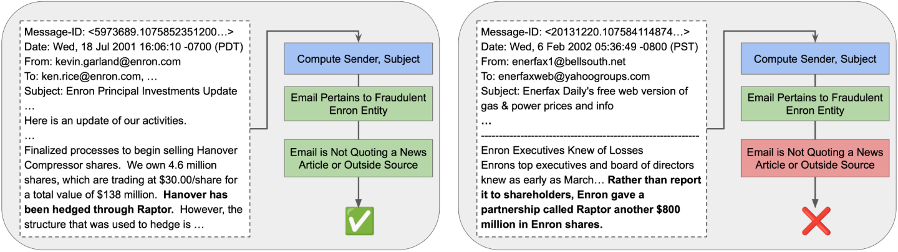
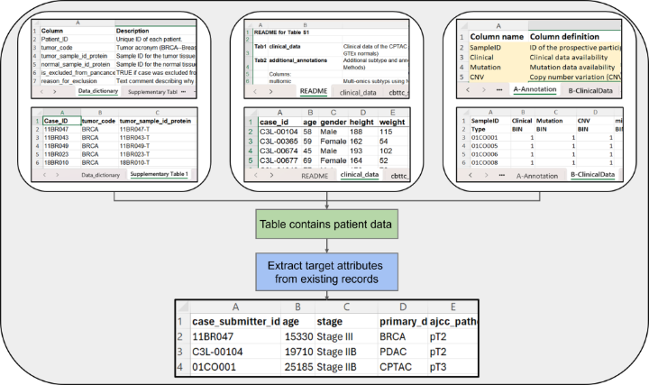
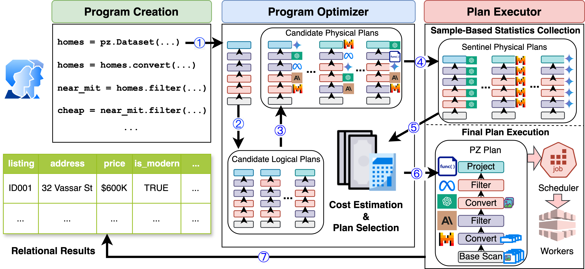
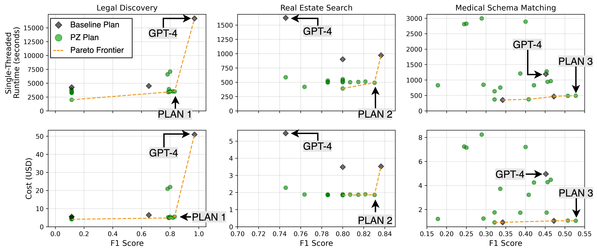
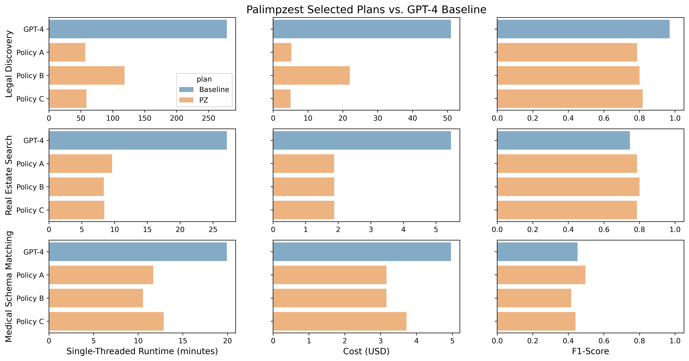
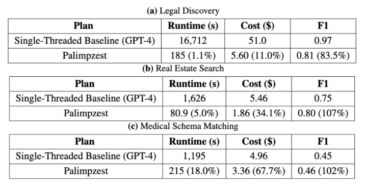

<!-- ---
title: "A Declarative System for Optimizing AI Workloads"
link: /palimpzest
summary: "A long-standing goal of data management systems has been to build systems which can compute quantitative insights over large corpora of unstructured data in a cost-effective manner. Until recently, it was difficult and expensive to extract facts from company documents, data from scientific papers, or metrics from image and video corpora. Today's models can accomplish these tasks with high accuracy. However, a programmer who wants to answer a substantive AI-powered query must orchestrate large numbers of models, prompts, and data operations. For even a single query, the programmer has to make a vast number of decisions such as the choice of model, the right inference method, the most cost-effective inference hardware, the ideal prompt design, and so on. The optimal set of decisions can change as the query changes and as the rapidly-evolving technical landscape shifts. In this paper we present Palimpzest, a system that enables anyone to process AI-powered analytical queries simply by defining them in a declarative language. The system uses its cost optimization framework -- which explores the search space of AI models, prompting techniques, and related foundation model optimizations -- to implement the query plan with the best trade-offs between runtime, financial cost, and output data quality.  We describe the workload of AI-powered analytics tasks, the optimization methods that Palimpzest uses, and the prototype system itself. We evaluate Palimpzest on tasks in Legal Discovery, Real Estate Search, and Medical Schema Matching. We show that even our simple prototype offers a range of appealing plans, including one that is 3.3x faster and 2.9x cheaper than the baseline method, while also offering better data quality. With parallelism enabled, Palimpzest can produce plans with up to a 90.3x speedup at 9.1x lower cost relative to a single-threaded GPT-4 baseline, while obtaining an F1-score within 83.5% of the baseline. These require no additional work by the user."
status: current
image: imgs/palimpzest.png
--- -->

import Bibtex from './bibtex.js';


[](https://discord.gg/dN85JJ6jaH)
[](https://colab.research.google.com/drive/1Fm8I4yL1az395MsFkQbEIZSmUZs0oGvZ?usp=sharing)
[](https://pypi.org/project/palimpzest/)
[](https://pypi.org/project/palimpzest/)
[](https://github.com/mitdbg/palimpzest)
- [Paper](https://arxiv.org/pdf/2405.14696)
- [Code](https://github.com/mitdbg/palimpzest)
- [Colab Demo](https://colab.research.google.com/drive/1Fm8I4yL1az395MsFkQbEIZSmUZs0oGvZ?usp=sharing)
- [Discord](https://discord.gg/dN85JJ6jaH)

{/* truncate */}

## Scaling Modern AI Systems to Large Corpora is Challenging
Advances in AI models have driven progress in applications such as question answering, chatbots, autonomous agents, and code synthesis. In many cases these systems have evolved far beyond posing a simple question to a chat model: they are complex [AI systems](https://bair.berkeley.edu/blog/2024/02/18/compound-ai-systems/) that combine elements of data processing, such as Retrieval Augmented Generation (RAG); ensembles of different models; and multi-step chain-of-thought reasoning.

It is easy for the runtime, cost, and complexity of these AI systems to escalate quickly, particularly when applied to large collections of documents. This places a burden on the AI system developer to marshal numerous optimizations in order to optimally manage trade-offs between runtime, cost, and output quality. To better motivate the challenges we face, let us first consider three examples from an emerging class of workloads.

### Semantic Analytics Applications (SAPPs)
Consider the following AI-powered analytical tasks:
- **Legal Discovery:** In this use case, prosecutors conducting an investigation wish to identify emails from defendants which are (a) related to corporate fraud (e.g., by mentioning a specific fraudulent investment vehicle) and (b) do not quote from a news article reporting on the business in question. Test (a) may be implemented using a regular expression or UDF, while (b) requires semantic understanding to distinguish between employees sharing news articles versus first-hand sources of information. An efficient implementation would recognize that (a) can likely be implemented using conventional and inexpensive methods, while (b) may require an LLM or newly-trained text model to retain good quality.


<center>
<p>
<strong>Figure 1a:</strong> A positive and negative example from the Legal Discovery workload. See Section 5.2 in <a href="https://arxiv.org/pdf/2405.14696">our paper</a> for more details.
</p>
</center>

- **Real Estate Search:** In this use case, a homebuyer wants to use online real estate listing data to find a place that is (a) modern and attractive, and (b) within two miles of work. Test (a) is a semantic search task that possibly involves analyzing images, while (b) is a more traditional distance calculation over extracted geographic data.  Any implementation needs to process a large number of images and listings, limit its use of slow and expensive models, and still obtain high-quality results.


<center>
<p>
<strong>Figure 1b:</strong> A positive and negative example from the Real Estate Search workload. See Section 5.2 in <a href="https://arxiv.org/pdf/2405.14696">our paper</a> for more details.
</p>
</center>

- **Medical Schema Matching:** In the medical domain, cancer research is often based on large collections of information about patient cases and sample data. However, research studies' data outputs do not always conform to a unified standard. In this use case, based on the medical data pipeline described by [Li, *et al.*](https://www.cell.com/cancer-cell/fulltext/S1535-6108(23)00219-2), we imagine a researcher who would like to (a) download the datasets associated with a dozen specified cancer research papers, (b) identify the datasets that contain patient experiment data, and (c) integrate those datasets into a single table.  Step (a) requires parsing and understanding research paper texts to obtain dataset URLs, step (b) requires classifying each dataset as either patient-related or not, and step (c) requires a complex data integration task. As with the use cases above, the programmer must manage multiple subtasks, each of which offer different possible optimization opportunities and quality trade-offs.


<center>
<p>
<strong>Figure 1c:</strong> Overview of the workflow for the Medical Schema Matching workload. See Section 5.2 in <a href="https://arxiv.org/pdf/2405.14696">our paper</a> for more details.
</p>
</center>

These tasks:
1. Interleave traditional data processing with AI-like semantic reasoning
2. Are data-intensive: each source dataset could reasonably range from hundreds to millions of records
3. Can be decomposed into an execution tree of distinct operations over sets of data objects

Taken together, these criteria outline a broad class of AI programs that are important, complex, and potentially very optimizable; we call them ***semantic analytics applications*** -- or, **SAPPs**. We believe there is a large set of such use cases that mix conventional data analytics with transformations and filters that would not be possible without AI methods. Such workloads frequently require interleaved data acquisition steps, conventional analytical queries, and AI operations. The AI operations process unstructured data, require broad domain knowledge to implement, or have specifications that users may not be able to implement correctly with traditional source code.

## Challenges Scaling AI Systems to Process SAPPs
Naively scaling AI Systems to process SAPPs with thousands or millions of inputs appears to require spending a huge amount of runtime and money executing high-end AI models. It is easy to show via back-of-the-envelope calculations that some high-quality LLMs process *fewer than 1 KB of text per second*, while others cost *5 USD for processing just 5MB of data*. These numbers are many orders of magnitude worse than any other component of the modern data processing stack. Thus, optimizing the use of AI components is crucial, while at the same time current AI infrastructure is in a state of tremendous technical flux. Harnessing the latest advances in model runtime, cost, and quality is complex, error-prone, and requires engineers to constantly rewrite and retune their systems.

Consider the wide range of technical decisions an AI engineer faces:
- **Prompt Design:** the engineer must optimize wording and decide on a general prompting strategy (e.g., zero-shot, few-shot, chain-of-thought, ReAct, etc.).
- **Model Selection:** the engineer must pick the best model *for each substask in the program*, balancing time, cost, and quality.
- **Execution Strategy:** the engineer must decide whether each subtask is best implemented by a foundation model query, synthesized code, or a locally-trained student model. Furthermore, they must consider how to combine tasks to improve GPU cache utilization, and how to avoid running over LLM context limits.
- **System Scaling:** When scaling out to a larger dataset, the engineer faces additional challenges in selecting an efficient execution plan. Even if the system performs well on a small dataset, it may require redesign to ensure reasonable runtime, cost, and performance at a larger scale. This may involve enabling parallelism for each component and integrating these parallelized components seamlessly into the broader system for optimal efficiency. 
- **External Integration:** When integrating with external data systems, the engineer must decide how to choose parameters (e.g., the number of chunks to return per RAG query) in a manner that yields the best speed, cost, and quality trade-offs.

The space of possible decisions is vast, and choosing wisely depends on low-level details of the exact task being performed.

## Declarative Programming to the Rescue (Again)
Our key insight is that machines, not human engineers, should decide how best to optimize semantic analytics applications. Engineers should be able to write AI programs at a high level of abstraction and rely on the computer to find an optimized implementation that best fits their use case. A similar set of circumstances -- a need for performance improvements for an important workload, during a time of enormous technical change -- led to the development of the relational database query optimizer in the 1970s. Today's underlying technical challenges are very different, but the basic idea of declarative program optimization remains valuable.

Consider the declarative program shown below, which we used in our evaluation for the Legal Discovery workload:

```python{numberLines: true}
import palimpzest as pz

class Email(pz.TextFile):
  """Represents an email, which can subclass a text file"""
  sender = pz.StringField(desc="The email address of the sender", required=True)
  subject = pz.StringField(desc="The subject of the email", required=True)

# define logical plan
emails = pz.Dataset(source="enron-emails", schema=Email) # invokes a convert operation
emails = emails.filter("The email is not quoting from a news article or an article ...")
emails = emails.filter("The email refers to a fraudulent scheme (i.e., \"Raptor\", ...")

# user specified policy
policy = pz.MinimizeCostAtFixedQuality(min_quality=0.8)

# execute plan
results = pz.Execute(emails, policy=policy)
```

In this program, the user wants to identify emails that are not quoting from sources outside of Enron and that reference fraudulent investment vehicles. The program can be decomposed into the following pieces:
- **Lines 3-6:** the programmer uses Palimpzest to create a custom schema for an `Email`.
- **Line 9:** the programmer creates a `Dataset` of `Emails`
  - The `source` string `"enron-emails"` uniquely identifies a set of files that have been preregistered with Palimpzest.
  - The specification of a `schema` instructs Palimpzest to transform the raw input data objects into the `Email` schema.
  - The transformed results are stored the `emails` Dataset.
- **Line 10:** the program filters `emails` for the subset which are not quoting from news articles.
- **Line 11:** the program filters for `emails` which discuss fraudulent investment entities.

The programmer takes two more steps:
- **Line 14:** she specifies a `policy` that describes how the system should choose among multiple possible implementations of the steps described so far.
  - (In this case, the plan with the lowest expected financial cost, subject to a lower bound on quality, is preferred.)
- **Line 17:** the programmer asks Palimpzest to `Execute()` the program, this entails:
  - Generating a logical execution plan
  - Generating multiple optimized physical execution plan candidates
  - Choosing one according to the specified policy
  - And finally, executing the code and yielding results

Programs written with Palimpzest are executed lazily, thus no actual data processing occurs until line 17.

## Palimpzest System
In our paper we lay out a vision and a prototype for **Palimpzest**, a system that enables engineers to write succinct, declarative code that can be compiled into optimized programs. Palimpzest is designed to optimize the broad SAPP workload class, which should encompass large-scale information extraction, data integration, discovery from scientific papers, image understanding tasks, and multimodal analytics. When running an input user program, Palimpzest considers a range of logical and physical optimizations, then yields a set of possible concrete executable programs. Palimpzest estimates the cost, time, and quality of each one, then chooses a program based on runtime user preferences. The system is designed to be extensible, so that new optimizations can be easily added in the future. Just as the RDBMS allowed users to write database queries more quickly and correctly than they could by writing traditional code, Palimpzest will allow engineers to write better AI programs more quickly than they could unaided.


<center>
<p>
<strong>Figure 2:</strong> Overview of the Palimpzest system architecture. See Section 3.4 in <a href="https://arxiv.org/pdf/2405.14696">our paper</a> for more details.
</p>
</center>

We summarize the main system steps here:
1. The user writes a declarative AI program using the Palimpzest (PZ) library; this gets compiled to an initial logical plan.
2. Palimpzest applies logical optimizations to transform the initial logical plan into a set of logical plans.
3. Palimpzest applies physical optimizations to create a much larger set of candidate physical plans.
4. Palimpzest executes **sentinel plans** to gather sample execution data.
5. The sample execution data is used to perform better cost estimation for the candidate physical plans.
6. The final plan is selected based on plan estimates and a user-specified policy for choosing among plans.
7. The final plan is executed and results are yielded to the user.

For more details on each of these steps, please see Subsection 3.4 and Section 4 in <a href="https://arxiv.org/pdf/2405.14696">our paper</a>.


## Palimpzest Creates Plans with Diverse Trade-offs
Our first experimental claim is that the Palimpzest prototype can use the three optimization strategies we implemented to create a set of physical plans that offered appealing trade-offs, regardless of the user policy. Figure 3 shows the **observed** -- not estimated -- runtime, cost, and quality that came from executing three baseline plans and ~20 of the most Pareto optimal plans suggested by Palimpzest. Plans closer to the bottom-right of each subplot are better.


<center>
<p>
<strong>Figure 3:</strong> Results from running the baselines and ~20 most Pareto optimal plans for each workload. See Section 5.3 in <a href="https://arxiv.org/pdf/2405.14696">our paper</a> for more details.
</p>
</center>

We found that Palimpzest is able to create useful plans at a number of different points in the trade-off space. On the Legal Discovery workload, Palimpzest was able to suggest physical plans (e.g. `PLAN 1`) that dominated the GPT-3.5 and Mixtral baselines, with an F1-score that is 7.3x and 1.3x better (respectively) at lower runtime and cost. Compared to the GPT-4 baseline, Palimpzest produced a cluster of plans near `PLAN 1` that are ~4.7x faster and ~9.1x cheaper, while still achieving up to 85.7% of the GPT-4 plan's F1-score. On the Real Estate Search and Medical Schema Matching workloads, Palimpzest was able to produce plans with runtime speedups and cost savings in the range of 2.4x-4.6x, while also achieving better F1-scores than their GPT-4 baselines.

Palimpzests' plans used a number of distinct optimizations to outperform the baselines:
- **On Legal Discovery:** `PLAN 1` made use of **model selection** to judiciously swap calls to GPT-4 with faster and less expensive calls to GPT-3.5 and Mixtral-8x7B when it did little to diminish result quality. Other plans similar to `PLAN 1` used **synthesized code** to replace LLM calls entirely.
- **On Real Estate Search:** `PLAN 2` made use of Palimpzest's logical optimizations to perform all text processing and filtering prior to any image processing, which required using a slow and expensive vision model.
- **On Medical Schema Matching:** `PLAN 3` made use of model selection and **input token reduction** (i.e. compressing the total number of input tokens processed by the LLM).


## Palimpzest Optimizer Selects High-Quality Plans
Our second experimental claim is that Palimpzest can identify plans that have better end-to-end runtime, cost, and quality than a naive plan that uses the same state-of-the-art language model for each operation. To evaluate this claim, we ran three policies for each workload:
- **Policy A** was to maximize quality at cost \<$20.0, $3.0, and $2.0 for Legal Discovery, Real Estate Search, and Medical Schema Matching, respectively.
- **Policy B** was to maximize quality at runtime \<10,000s, 600s, and 1000s (for the same order of workloads)
- **Policy C** was to minimize cost at an F1-score >0.8, 0.8, and 0.4 (for the same order of workloads).

These fixed cost, quality, and runtime thresholds were set to be challenging, yet physically attainable based on our results from the previous section.

Figure 4 presents our results across three performance metrics, with each metric displayed in a separate column. The results are organized by workload, with each workload represented in a row of subplots. Within each subplot, results are further divided by the physical plan selected by the optimizer, with each plan occupying a separate row. We compared the plans chosen by Palimpzest to a baseline plan, which employs GPT-4 for all conversion and filtering operations.


<center>
<p>
<strong>Figure 4:</strong> Results from running Palimpzest on each workload for three different policies. See Section 5.4 in <a href="https://arxiv.org/pdf/2405.14696">our paper</a> for more details.
</p>
</center>

Overall, we found that Palimpzest identifies plans in the space of physical candidates which:
1. Offer significant performance improvements over the GPT-4 baseline
2. Generally satisfy policy constraints (7 out of 9 satisfied), and
3. Have speedups and cost savings which outweigh the overhead of collecting sample data.

For example, on the Legal Discovery workload (first row in Figure 4), the plan selected by Palimpzest for **Policy A** achieved a runtime and financial cost that are 80.0% and 89.7% lower than the GPT-4 baseline, respectively, at an F1-score within 81.1% of the baseline. The system achieved similar results for **Policy C**, with slightly better quality (within 84.3% of the baseline).

For the Real Estate Search workload (second row in Figure 4), the plans chosen by Palimpzest achieved (on average) 67.5% lower runtime, 65.7% lower cost, and 6% better F1-score than the baseline GPT-4 plan. Finally, on the Medical Schema Matching workload (third row in Figure 4), Palimpzest was able to identify plans that provide up to 47.2% and 36.3% lower runtime and cost, respectively, at comparable F1-scores to the GPT-4 baseline.

## Palimpzest Can Provide Speedups of up to 90.3x for Free
For our final evaluation, we ran Palimpzest with parallel implementations of its most time-consuming operations to demonstrate the system's ability to achieve large runtime speedups -- with competitive costs and F1-scores -- relative to a single-threaded baseline plan. We allowed each parallelized operator within Palimpzest to use 32 workers. The results of our evaluation are shown in Figure 5.


<center>
<p>
<strong>Figure 5:</strong> Results from running Palimpzest with parallelism enabled. See Section 5.5 in <a href="https://arxiv.org/pdf/2405.14696">our paper</a> for more details.
</p>
</center>

We can see that on Legal Discovery, Palimpzest achieved a **90.3x speedup at 9.1x lower cost while obtaining an F1-score within 83.5% of the GPT-4 baseline**. On Real Estate Search and Medical Schema matching, the optimized plan dominated the GPT-4 baseline on all metrics. **These plans achieve better F1-scores than their baselines, and do so with speedups of 20.0x and 5.6x as well as cost savings of 2.9x and 1.5x, respectively.**

We do not use any exotic algorithms, and of course it is straightforward to run model prompts in parallel.  Palimpzest's abstractions simply allow the system to obtain these speedups with no additional work by the user.


## Read the Paper

[Chunwei Liu*, Matthew Russo*, Michael Cafarella, Lei Cao, Peter Baile Chen, Zui Chen, Michael Franklin, Tim Kraska, Samuel Madden, Gerardo Vitagliano. A Declarative System for Optimizing AI Workloads](https://arxiv.org/pdf/2405.14696)

\* Denotes equal contribution.

<Bibtex>{`@inproceedings{palimpzestCIDR,
    title={Palimpzest: Optimizing AI-Powered Analytics with Declarative Query Processing},
    author={Liu, Chunwei and Russo, Matthew and Cafarella, Michael and Cao, Lei and Chen, Peter Baile and Chen, Zui and Franklin, Michael and Kraska, Tim and Madden, Samuel and Shahout, Rana and Vitagliano, Gerardo},
    booktitle = {Proceedings of the {{Conference}} on {{Innovative Database Research}} ({{CIDR}})},
    date = 2025,
}`}</Bibtex>

## Project Participants

Chunwei Liu, Matthew Russo, Michael Cafarella, Peter Baile Chen, Zui Chen, Tim Kraska, Samuel Madden, Gerardo Vitagliano 
